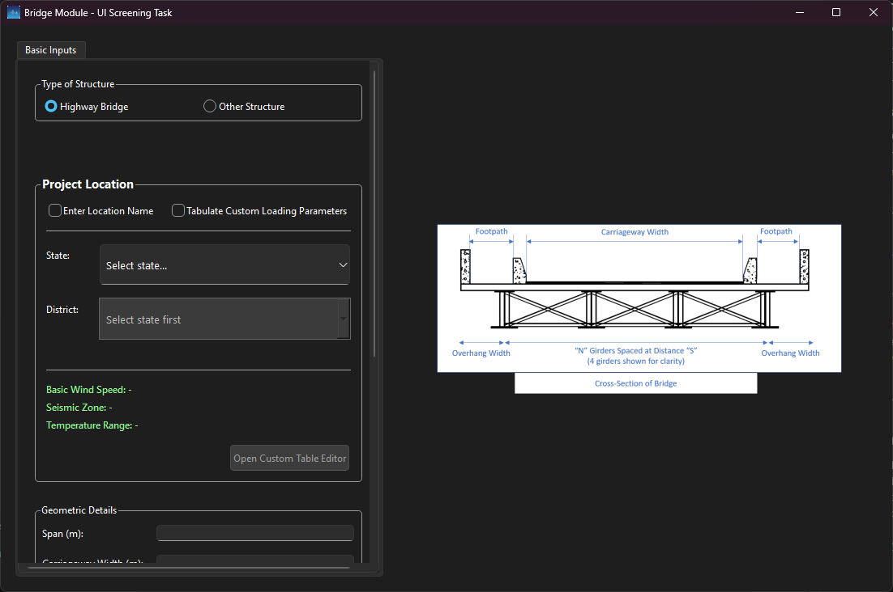
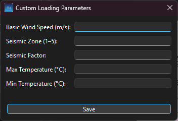
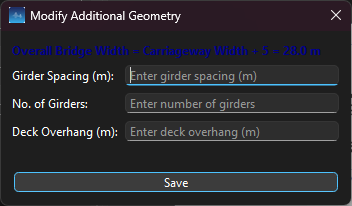

# Bridge Module - UI Screening Task

A professional PySide6 desktop application for bridge design input management. This engineering module provides an intuitive interface for collecting geometric, material, and environmental parameters required for highway bridge analysis. The application features database-driven environmental loading data (wind speed, seismic zone/factor, temperature ranges) for locations across India, with support for custom parameter input when needed.

---

## Features

### Core Functionality
- **Type of Structure Selection** - Choose between Highway Bridge and Other Structure types
- **Project Location Management** - Two flexible modes for environmental parameter input:
  - **Mode A: Enter Location Name** - Database-driven selection with automatic parameter population
  - **Mode B: Custom Loading Parameters** - Manual input via dedicated popup dialog
- **Modify Additional Geometry** - Intelligent popup with auto-calculating girder spacing, count, and overhang
- **Geometric Inputs** - Span, carriageway width, footpath configuration, and skew angle
- **Material Inputs** - Steel grades (E250/E350/E450) and concrete grades (M25-M60)
- **Real-time Input Validation** - Range checking with visual warnings and error messages
- **Scrollable UI Layout** - Clean, organized interface with proper spacing for comfortable viewing
- **Standalone EXE** - Fully bundled executable with all dependencies included

### UI Design
- **GroupBox Organization** - Logical sections with clear visual hierarchy
- **Generous Spacing** - 25px vertical spacing, 20px margins for readability
- **Dark Mode Friendly** - Custom styling for disabled states and visual elements
- **Scroll Support** - Responsive scroll area for varying screen sizes
- **Premium Controls** - 38px combo boxes, 36px buttons, 13px fonts

---

## Database Integration

### Environmental Data
The application includes a SQLite database (`data/locations.db`) containing **244 location records** across India with the following parameters:

- **States** - Andhra Pradesh, Telangana, Uttar Pradesh, West Bengal, Assam, and more
- **Districts** - Multiple districts per state
- **Wind Speed** - Basic wind speed in m/s (IRC standards)
- **Seismic Zone** - Zone classification (I-V)
- **Seismic Factor** - Zone-specific seismic factor
- **Temperature Range** - Maximum and minimum design temperatures (°C)

### Auto-Population Logic
When a user selects a state and district in **Mode A**:
1. State dropdown loads all available states from the database
2. District dropdown dynamically populates based on selected state
3. Environmental parameters automatically update in green labels:
   - Basic Wind Speed: XX m/s
   - Seismic Zone: X | Factor: X.X
   - Temperature Range: XX°C – XX°C

The application uses `blockSignals()` to prevent infinite loops during programmatic updates, ensuring smooth and stable operation.

---

## Custom Table Editor Popup

When **Mode B: Tabulate Custom Loading Parameters** is selected, users can click "Open Custom Table Editor" to manually input environmental data.

### Input Fields
- **Basic Wind Speed (m/s)** - Validated with `QDoubleValidator` (0.0-500.0)
- **Seismic Zone (1-5)** - Validated with `QIntValidator`
- **Seismic Factor** - Double precision input
- **Max Temperature (°C)** - Design maximum temperature
- **Min Temperature (°C)** - Design minimum temperature

### Behavior
- All fields are **required** before saving
- Validation ensures positive wind speed and valid zone numbers
- Saved values **override database values** and update the green parameter labels
- State/District dropdowns are **disabled** in this mode to prevent conflicts

---

## Modify Additional Geometry Popup

This intelligent dialog calculates bridge geometry based on carriageway width.

### Calculation Logic
**Overall Bridge Width = Carriageway Width + 5.0 m**

The popup features **bidirectional auto-calculation** between three parameters:
- **Girder Spacing (m)** - Distance between girders
- **Number of Girders** - Integer count
- **Deck Overhang (m)** - Edge overhang distance

### Smart Updates
- Changing **spacing** → auto-calculates girder count
- Changing **girder count** → auto-calculates spacing
- Changing **overhang** → adjusts spacing accordingly
- Uses `blockSignals()` to prevent infinite loops
- Focus-based updates ensure only the active field triggers recalculation
- Real-time validation with error messages for invalid values

---

## Project Structure

```
BridgeModule/
│── BridgeInputModule.exe      
│── README.md                  
│── src/                      
│    ├── main.py
│    ├── ui/
│    ├── data/
│    ├── assets/
│── pdfs/                     
│── video.mp4            

```

---

## Installation & Running

### Option 1: Run the Standalone EXE (Recommended)
No Python installation required. Simply double-click:

```bash
.\BridgeInputModule.exe
```

The executable includes all dependencies, the database, and assets bundled together.

### Option 2: Run from Source

#### Prerequisites
- Python 3.11+
- [uv](https://github.com/astral-sh/uv) package manager (recommended)

#### Setup with uv
```bash
# Clone or navigate to the project directory
cd BridgeModule

# Install dependencies
uv sync

# Run the application
uv run python main.py
```

#### Setup with pip (alternative)
```bash
# Create virtual environment
python -m venv .venv

# Activate virtual environment
# Windows:
.\.venv\Scripts\Activate.ps1
# Linux/Mac:
source .venv/bin/activate

# Install dependencies
pip install PySide6

# Run the application
python main.py
```

---

## Packaging Details

### Building the Executable

The application uses **PyInstaller** to create a standalone Windows executable with optimized size and performance.

#### Build Command
```bash
pyinstaller BridgeInputModule.spec
```

#### Optimization Features
- **UPX Compression** - Reduces executable size
- **Module Exclusion** - 30+ unused modules excluded (QtWebEngine, QtNetwork, matplotlib, numpy, etc.)
- **Asset Bundling** - Database and images included via `datas` parameter
- **No Console Window** - Clean GUI launch with `console=False`
- **PyInstaller Resource Path** - Uses `sys._MEIPASS` for runtime asset loading

#### Spec File Highlights
```python
datas=[
    ('data/locations.db', 'data'),
    ('assets', 'assets'),
],
excludes=[
    'PySide6.QtNetwork',
    'PySide6.QtWebEngine',
    'matplotlib', 'numpy', 'pandas',
    # ... 30+ more excluded modules
],
```

**Result:** 50 MB standalone executable with all dependencies bundled.

---

## Input Validation & Warnings

The application provides real-time validation with color-coded feedback:

### Validation Rules
- **Span** - Must be between 20-45 m (red error if outside range)
- **Skew Angle** - Must be between -15° to +15° (orange warning if outside, per IRC 24:2010)
- **Carriageway Width** - Required before opening geometry dialog
- **Custom Parameters** - All fields validated with appropriate data types

### Visual Feedback
- 🔴 **Red Errors** - Invalid input, out of range values
- 🟠 **Orange Warnings** - IRC compliance notices
- 🟢 **Green Labels** - Successfully loaded environmental parameters

---

## Screenshots

### Main Interface
The complete UI showing Project Location, Geometric Details, Material Inputs, and the reference bridge cross-section diagram.



### Custom Table Editor
Manual input dialog for custom environmental loading parameters.



### Modify Geometry Dialog
Intelligent auto-calculation popup for girder spacing, count, and deck overhang.



---

## Technical Highlights

- **16 uses of blockSignals()** - Prevents infinite loops in bidirectional updates
- **244 database records** - Comprehensive location coverage across India
- **Focus-based updates** - Smart field detection prevents calculation conflicts
- **Try-except throughout** - Crash-proof validation and error handling
- **Resource path helper** - Seamless compatibility between development and PyInstaller builds

---

## Credits

### Environmental Data Sources
Environmental loading parameters are derived from standard Indian engineering codes:

- **Wind Speed** - IRC:6 (Standard Specifications and Code of Practice for Road Bridges)
- **Seismic Data** - IS 1893 (Criteria for Earthquake Resistant Design of Structures)
- **Temperature Ranges** - IRC:6 (Section II - Loads and Stresses)

All data is compiled for reference purposes and should be verified against the latest code revisions for production use.

---

## License

MIT License

Copyright (c) 2025

Permission is hereby granted, free of charge, to any person obtaining a copy of this software and associated documentation files (the "Software"), to deal in the Software without restriction, including without limitation the rights to use, copy, modify, merge, publish, distribute, sublicense, and/or sell copies of the Software, and to permit persons to whom the Software is furnished to do so, subject to the following conditions:

The above copyright notice and this permission notice shall be included in all copies or substantial portions of the Software.

THE SOFTWARE IS PROVIDED "AS IS", WITHOUT WARRANTY OF ANY KIND, EXPRESS OR IMPLIED, INCLUDING BUT NOT LIMITED TO THE WARRANTIES OF MERCHANTABILITY, FITNESS FOR A PARTICULAR PURPOSE AND NONINFRINGEMENT. IN NO EVENT SHALL THE AUTHORS OR COPYRIGHT HOLDERS BE LIABLE FOR ANY CLAIM, DAMAGES OR OTHER LIABILITY, WHETHER IN AN ACTION OF CONTRACT, TORT OR OTHERWISE, ARISING FROM, OUT OF OR IN CONNECTION WITH THE SOFTWARE OR THE USE OR OTHER DEALINGS IN THE SOFTWARE.

---

## Support

For issues, questions, or contributions, please refer to the project repository or contact the development team.

**Version:** 1.0.0  
**Last Updated:** November 2025
